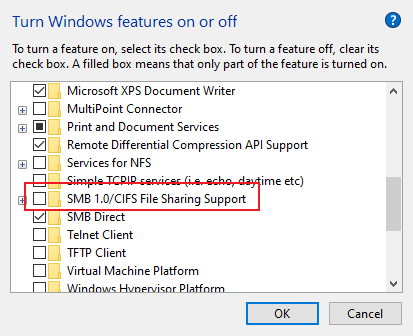
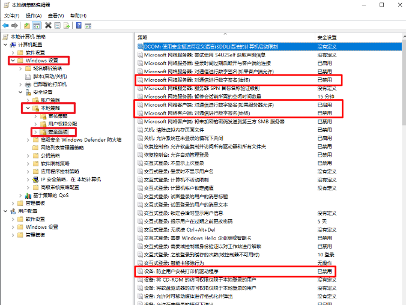

# SMB配置

同一局域网下，DESKTOP作冷存储，LAPTOP访问

DESKTOP配置：
- x79 主板 
- E5 洋垃圾
- ECC ddr3 16G
- 电源
- 机箱
- SSD + 希捷2T
- RX588

总计：200+30+35+100+35+250+300=950

# 环境

两台win10

- 主力机 Local

- 存储机（被访问的远程机器） Remote

# 思路

1. 关闭SMB1，防止中间人攻击。  JUST FOR SEC.

2. Remote新建低权限用户提供SMB共享；本地安全策略禁止启用来宾身份相关的安全设置

3. Local手动添加证书，使用映射网络驱动器形式访问共享资源。

   

# Local远程桌面

1. 【Remote Desktop Connection】 window自带的
2. 【推荐】【 Microsoft Remote Desktop】微软商店下载（比1舒服，自适应分辨率，显示任务栏，UI好看）

# Remote

1. 关闭 SMB1，防止中间人攻击。	

   

2. 创建SMB用户

3. 配置安全设置
   1. CMD gpedit.msc 打开“本地组策略编辑器”
      - 禁用不安全的来宾登录，防止中间人攻击。	
      - 本地安全选项设置
      
   2. CMD secpol.msc 打开 “本地安全策略”
      - 授予用户“从网络访问此计算机”的权限
      
      - 限制用户登录到系统上：“拒绝本地登录”和“拒绝通过远程桌面服务登录”
      
   3. 控制面板 -- 网络和共享中心  关闭网络发现隐藏本机，启用“文件和打印机共享”和密码保护
   
4. 设置share共享文件夹，将文件夹的权限更改为只有SMB用户完全控制
  
  
  
# Local

1. 添加windows凭证

2. 映射网络驱动器

   

# 参考

- https://post.smzdm.com/p/akxwkxqk/
- https://blog.csdn.net/liu502617169/article/details/92089027 